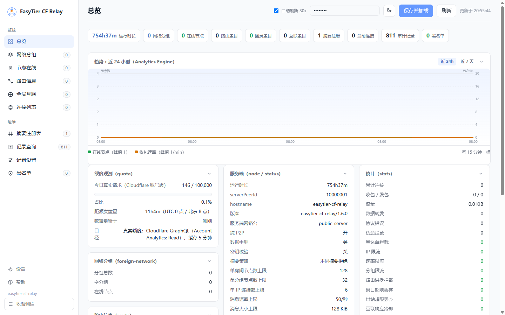

# EasyTier Cloudflare Relay V1.6.1

在 Cloudflare Workers 免费额度内运行 EasyTier 自建 WebSocket 节点——无需 VPS，
客户端 `-p wss://<你的域名>/` 即可组网。纯 P2P 优先（中继仅兜底），全 Hibernation API 空闲成本趋零。

已用 easytier-core **2.6.4** 官方客户端实测：握手、路由同步、双节点互见、数据中继全部通过。

<div align="center">

</div>

[](docs/更新日志.md) [](https://github.com/WWSTA/easytier-cf-relay/stargazers) [](LICENSE) [](https://workers.cloudflare.com/) [](docs/技术文档.md) [](#) [](#)

由于作者不太会Workers的开发，所以使用了**国模**进行全栈开发。虽然与国模进行了不少友好交流，但是可能仍然有一些不影响使用的特性，下个版本会继续修，欢迎各位有想法的fork修理。（更新花费越来越大，总花费和使用模型可以看更新日志）

> [!TIP]
>
> V1.6.0版本大升级(V1.6.1修复了两个BUG），管理页换新，功能已尽可能完善，建议升级（后续更新会放缓，作者的大部分想法已实现，当然还有一些以后再说）（wrangler.toml 的配置比较多，建议使用wrangler.toml 配置生成器）


---

## 介绍站点

本项目配套一套 介绍网站 ，包含：

- **项目主页** — 功能特性、快速开始、架构图、成本与额度、已知限制
- **wrangler.toml 配置生成器** — 分类表单调整全部配置项（默认值与仓库 `wrangler.toml` 逐项一致），实时预览与校验，一键复制 / 下载可直接部署的配置文件**（建议使用）**
- **文档网页版** — 部署手册 / 技术文档 / 更新日志全文收录，支持「完整 / 精炼」双视图与明暗主题切换

**在线访问**：[easytier-cf-relay-web](https://wwsta.github.io/easytier-cf-relay-web/)

------

## 演示节点

这是作者使用本项目部署好的节点[wss://ouret.ccwu.cc](https://ouret.ccwu.cc/)（由于免费额度有限，为了让更多人使用，已禁中转）

> [!NOTE]
>
> 由于本作者的节点**域名**在"移动"的国际链路上可能被 **TLS SNI 黑名单拦截**，所以"移动"网络下可能会连接失败（只是作者用的域名有问题，服务器是没有问题，换一个域名其实就可以了，这段时间为了查明这个头疼了不久，所以更新慢了）

---

## 功能

- **协议兼容**：字节级对齐官方实现（握手 / OSPF 路由同步 / PeerCenter / 包转发）
- **纯 P2P 优先**：宣告 `avoid_relay_data`，客户端优先直连，中继只做兜底（可完全关闭）
- **网络隔离**：网络名 + 密钥摘要（SipHash-1-3，与官方同算法）分组隔离，支持 `NETWORK_SECRETS` 服务端密钥校验
- **幽灵节点六重防线**：握手超时 / 空闲超时 / 主动探活（连接级）+
  direct 覆盖规则与 reporter 追踪 / 路由老化（对齐官方 `clear_expired_peer`）/ 空分组自动删除（路由级）——
  彻底解决多 PeerId 竞争残留的"幽灵路由条目"
- **安全加固**：`/health` 零指纹（`HEALTH_PATH` 可自定义，配置后原路径不再暴露）；
  `/metrics` 与管理端为自定义安全路径 + token 双门禁（fail-closed）；
  三层事前限流（单 IP 并发上限 v1.4.1 / 单连接消息速率 v1.5 / 每分组节点上限 v1.5）+
  未知路径挂起不响应（v1.4.1）；
  转发校验源身份（v1.4.2 起覆盖全部 RPC 路径）、防路由投毒、防摘要抢占（注册表自愈）
- **Web 管理端**：侧边栏列表式导航（总览/节点/路由/互联/连接/分组/摘要注册/记录/黑名单），
  服务端分页 + 列表独立滚动（节点多时不爆炸），各功能块自带统计，
  全部支持**单个与批量操作**（踢出/删除分组/删除路由/删除互联/断开连接/删除摘要注册）——
  列表「操作」列按钮针对单行直接生效，无需勾选
- **观测升级**（v1.6）：`/metrics?format=prometheus` 文本指标（25 个
  `easytier_` 指标，可接 Grafana/自托管 Prometheus）；可选配置
  `CF_ACCOUNT_ID`+`CF_API_TOKEN` 后额度卡切换**账号级真实请求数**（GraphQL
  Analytics API，服务端缓存，token 不下发浏览器）；可选绑定 Analytics
  Engine 后总览新增近 24h / 7 天**趋势折线**（纯 SVG，零图表库）
- **资源滥用防线**（v1.6）：路由洪泛 / 请求放大 / 出站与状态总量多维上限
  （全部 env 可调，0 = 关闭），均为处理途中同步检查——正常用户免费额度
  零开销，被恶意刷量时防御侧近乎零消耗；管理端新增防线计数与摘要抢占
  嫌疑记录（含来源 IP）
- **KV 审计记录**：网络分组 / 节点在线 / 路由信息 / 全局互联 / 连接列表 / 摘要注册六类事件
  记录进 Workers KV（**每类只占一条 KV 键**），管理页可单独开关各类记录并设置存储上限，
  记录查询支持**「全部」跨类型合并视图**；管理员登录（IP/时间）与操作为
  **硬设置**（wrangler.toml `ADMIN_AUDIT`，管理页不可关闭；查看事件不记录）
- **管理端黑名单**：分四类（节点 PeerId / 网络分组 / 摘要注册 / 客户端 IP），每类一条 KV 键；
  踢出节点、删除分组、删除摘要、断开连接的操作对象自动进入黑名单并被拦截接入——
  IP 黑名单在 **Worker 入口边缘层直接拒绝（KV 读取带 30s isolate 缓存，不唤醒 DO）**，
  重连风暴不消耗 DO 请求与审计写入，KV 读也与重连次数解耦；
  黑名单页支持手工添加 / 移除（解除封锁）/ 批量清空
- **免费额度内稳定运行**：Hibernation + alarm 驱动，典型小网络日请求量约为限额的 5%；
  alarm 自适应排程（有连接对齐最近事件、空房间退避 5 分钟）+ `_markDirty`
  闹钟抖动修复；管理页自动刷新 30s 且页面不可见时暂停；
  KV 审计经内存缓冲 + DO storage + 节流镜像三级写入，写入量可控（见部署手册成本章节）
  

---

## 快速开始

```bash
npm install
npx wrangler login        # 浏览器授权
npx wrangler deploy       # 部署
curl https://<worker域名>/health   # {"ok":true}
```

客户端接入（任意平台）：

```bash
easytier-core --network-name myteam --network-secret s3cret! \
  --hostname node-a -p wss://<你的域名>/
```

本地开发：`npm run dev`（修改配置见 `wrangler.toml`，敏感变量可用 `npx wrangler secret put`）启动 wrangler dev，用官方客户端连接 `ws://127.0.0.1:8787/` 验证。

---

## 文档

| 文档 | 内容 |
|---|---|
| [部署手册](docs/部署手册.md) | 快速部署、全部配置项（含 KV 审计）、域名绑定、成本额度、运维、FAQ |
| [技术文档](docs/技术文档.md) | 协议实现详解、幽灵节点六重防线、KV 审计与黑名单设计、与官方对比、Hibernation 设计 |
| [更新日志](docs/更新日志.md) | 各版本变更明细 |

---

## 项目结构

```
src/    index.js（入口路由/鉴权） room.js（DO） peer_manager.js（分组/路由）
        rpc.js wire.js packet.js siphash.js proto*.js admin_ui.js（管理端）
        audit.js（KV 记录 + 黑名单） prometheus.js（指标输出）
docs/   部署手册 / 技术文档 / 更新日志
```

生产敏感变量（`METRICS_TOKEN` / `ADMIN_TOKEN` 等）通过 `wrangler secret put` 或
Cloudflare 控制台设置；本地 `wrangler dev` 如需覆盖可用 `.dev.vars` 文件（已 gitignore，
不随 deploy 上传）。

---

## 另一种选择

[【教程】Cloudflare Tunnel 自建 EasyTier 共享节点（无Docker，自定义域名 wss:// 接入，客户端自建虚拟局域网，再也不怕公益服务器掉线）](https://github.com/orgs/EasyTier/discussions/2512)

---

## 致谢

本项目站在前人肩膀上，感谢以下项目：

- **[EasyTier](https://github.com/EasyTier/EasyTier)** — 官方去中心化 mesh VPN。本实现的协议行为全部以官方源码（tag v2.6.4）为基准逐项对齐，并以官方客户端实测验证兼容性。
- **[IceSoulHanxi/easytier-ws-relay](https://github.com/IceSoulHanxi/easytier-ws-relay)** — 最早的 Cloudflare Workers 版 EasyTier WS 中继之一。其"幽灵节点"痛点直接催生了本项目的六重防线设计（握手超时 / 空闲超时 / 主动探活 + 路由级老化管理）。
- **[Teleseon/cf-workers-et-ws](https://github.com/Teleseon/cf-workers-et-ws)** — 活跃改进的 fork。其 DO 计费与 protobuf 兼容性经验（setInterval 常驻计费、Workers 上的 eval 限制）直接影响了本项目"全 Hibernation + pbjs 静态代码生成"的技术路线。
- **[21paradox/easytier-wsrelay](https://github.com/21paradox/easytier-wsrelay)** 与 **[PIKACHUIM/easytier-worker](https://github.com/PIKACHUIM/easytier-worker)** — 社区多语言/带面板方向的探索，其踩过的协议细节坑（PacketType 枚举、method_index 基数等）为本项目"逐字段对照官方源码修正"提供了前车之鉴。

---

## 许可

[MIT License](https://github.com/WWSTA/easytier-cf-relay/blob/main/LICENSE)

---

## 免责声明

本项目仅供学习交流使用，请勿用于任何商业用途或非法用途。使用本项目代码造成的任何后果，原作者概不负责。
